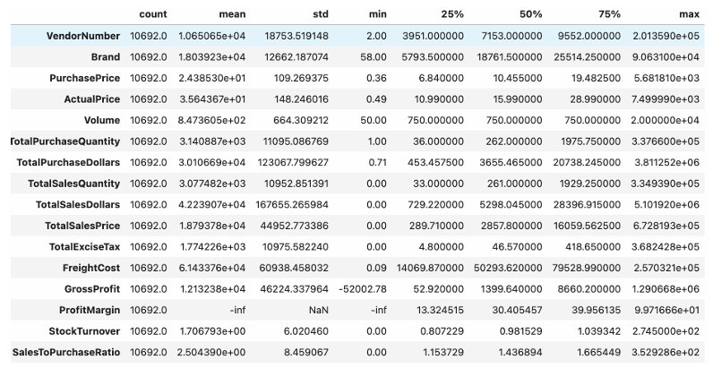
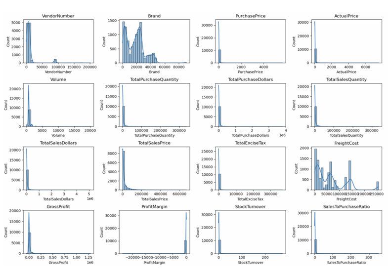
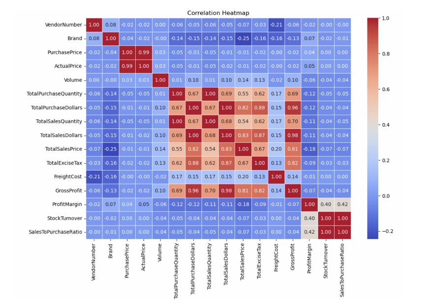
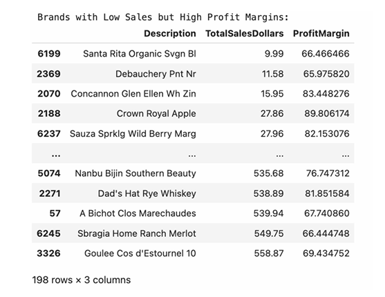
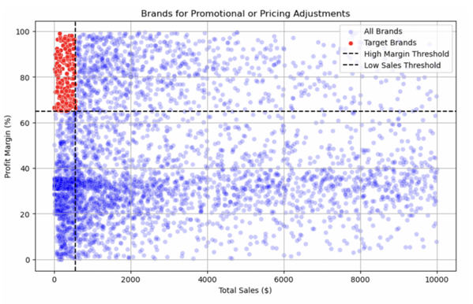
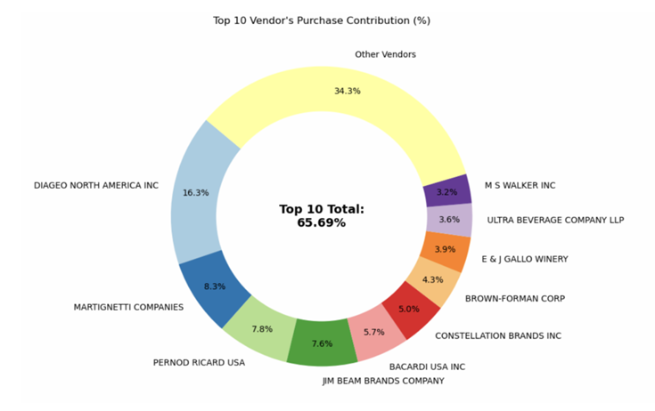
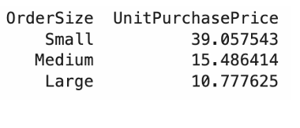
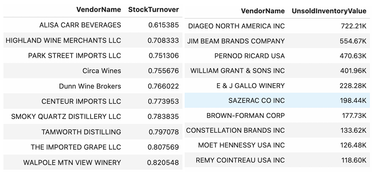
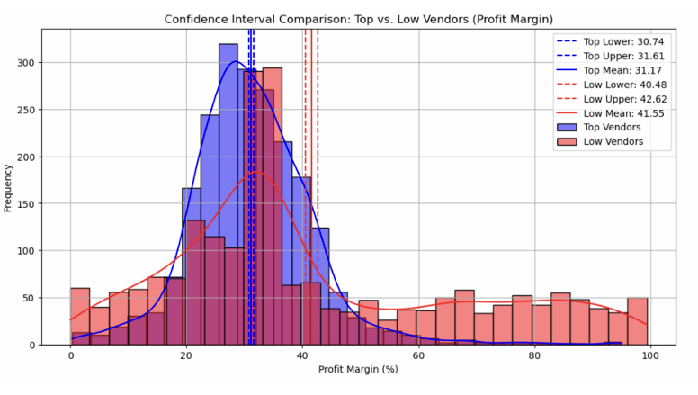

# 📦 Vendor Performance Report

## 📌 Business Problem

Effective inventory and sales management are critical for optimizing profitability in the retail and wholesale industry. Companies need to ensure that they are not incurring losses due to inefficient pricing, poor inventory turnover, or vendor dependency.

**The goal of this analysis is to:**
- Identify underperforming brands that require promotional or pricing adjustments  
- Determine top vendors contributing to sales and gross profit  
- Analyze the impact of bulk purchasing on unit costs  
- Assess inventory turnover to reduce holding costs and improve efficiency  
- Investigate the profitability variance between high-performing and low-performing vendors

---

## 📊 Exploratory Data Analysis Insights

### 🔢 Summary Statistics

#### Negative & Zero Values
- **Gross Profit:** Minimum of -52,002.78, indicating potential losses due to 
high costs or heavy discounts. This could be due to selling products at 
lower prices than their purchase costs. 
- **Profit Margin:** Has a minimum of -∞, which suggests instances where 
revenue is zero or even lower than the total cost, leading to extreme 
negative profit margins.
- **Total Sales Quantity & Sales Dollars:** Some products show zero sales, 
indicating they were purchased but never sold. These may be slow-moving 
or obsolete stock, leading to inventory inefficiencies. 

#### Outliers
- **Purchase & Actual Prices:** The maximum values (5,681.81 & 7,499.99) 
are significantly higher than the mean (24.39 & 35.64), indicating premium 
product offerings.
- **Freight Cost:** Extreme variation from 0.09 to 257,032.07 suggests logistics 
inefficiencies, bulk shipments, or erratic shipping costs across different 
products.
- **Stock Turnover:** Ranges from 0 to 274.5, suggesting some products sell 
rapidly while others remain unsold for long periods. A value greater than 1 
indicates that sales for a product exceed the purchased quantity due to 
older stock fulfilling orders. 
---

## 🧼 Data Filtering

To enhance the reliability of the insights, we removed inconsistent data 
points where: 
- Gross Profit ≤ 0 (to exclude transactions leading to losses).
- Profit Margin ≤ 0 (to ensure analysis focuses on profitable 
transactions).
- Sales Quantity = 0 (to eliminate inventory that was never sold).

---

## 🔗 Correlation Insights

- **Purchase Price vs. Total Sales Dollars & Gross Profit:** Weak correlation 
(-0.012 and -0.016), indicating that price variations do not significantly 
impact sales revenue or profit.
- **Total Purchase Quantity vs. Total Sales Quantity:** Strong correlation 
(0.999), confirming efficient inventory turnover.
- **Profit Margin vs. Total Sales Price:** Negative correlation (-0.179), 
suggesting increasing sales prices may lead to reduced margins, possibly 
due to competitive pricing pressures.
- **Stock Turnover vs. Gross Profit & Profit Margin:** Weak negative 
correlation (-0.038 & -0.055), indicating that faster stock turnover does not 
necessarily equate to higher profitability.
---

## ❓ Research Questions & Key Findings

### 1. Brands for Promotional or Pricing Adjustments

198 brands exhibit lower sales but higher profit margins, which could 
benefit from targeted marketing, promotions, or price optimizations to 
increase volume without compromising profitability. 

### 2. Top Vendors by Sales & Purchase Contribution

The top 10 vendors contribute 65.69% of total purchases, while the 
remaining vendors contribute only 34.31%. This over-reliance on a few 
vendors may introduce risks such as supply chain disruptions, indicating a 
need for diversification. 

### 3. Impact of Bulk Purchasing on Cost Savings

Vendors buying in large quantities receive a 72% lower unit cost ($10.78 
per unit vs. higher unit costs in smaller orders). 
Bulk pricing strategies encourage larger orders, increasing total sales while 
maintaining profitability. 

### 4. Identifying Vendors with Low Inventory Turnover

Total Unsold Inventory Capital: $2.71M 
Slow-moving inventory increases storage costs, reduces cash flow 
efficiency, and affects overall profitability. 
Identifying vendors with low inventory turnover enables better stock 
management, minimizing financial strain. 

  

### 5. Profit Margin Comparison: High vs. Low-Performing Vendors

- **Top Vendors’ Mean Profit Margin (95% CI):** (30.74%, 31.61%), Mean: 31.17%
- **Low Vendors’ Mean Margin (95% CI):**  (40.48%, 42.62%), Mean: 41.55%
- High margins don’t always lead to high volume.
  
Low-performing vendors maintain higher margins but struggle with sales 
volumes, indicating potential pricing inefficiencies or market reach issues.

Actionable Insights:

● Top-performing vendors: Optimize profitability by adjusting 
pricing, reducing operational costs, or offering bundled 
promotions. 

● Low-performing vendors: Improve marketing efforts, optimize 
pricing strategies, and enhance distribution networks. 

  

### 6. Statistical Validation of Profit Margin Differences

**Hypothesis Testing:**  
- **H₀: (Null Hypothesis)** No significant difference in profit margins between top 
and low-performing vendors.  
- **H₁: (Alternative Hypothesis)** A significant difference exists in profit margins 
between the two vendor groups.  
✅ Result: The null hypothesis is rejected, confirming that the two groups 
operate under distinctly different profitability models.

  ✅ Implication: High-margin vendors may benefit from better pricing 
strategies, while top-selling vendors could focus on cost efficiency.

---

## ✅ Final Recommendations

- Re-evaluate pricing for low-sales, high-margin brands to boost sales 
volume without sacrificing profitability.
- Diversify vendor partnerships to reduce dependency on a few 
suppliers and mitigate supply chain risks. 
- Leverage bulk purchasing advantages to maintain competitive pricing 
while optimizing inventory management. 
- Optimize slow-moving inventory by adjusting purchase quantities, 
launching clearance sales, or revising storage strategies. 
- Enhance marketing and distribution strategies for low-performing 
vendors to drive higher sales volumes without compromising profit 
margins.
- By implementing these recommendations, the company can achieve 
sustainable profitability, mitigate risks, and enhance overall 
operational efficiency.

---

By applying these recommendations, the company can improve profitability and reduce operational risks.
